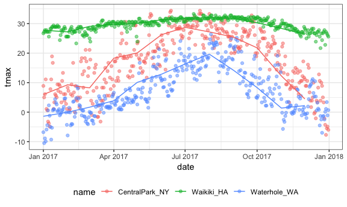

EDA
================
Jeff Goldsmith
10/4/2018

``` r
library(tidyverse)
```

    ## ── Attaching packages ────────────────────────────────────── tidyverse 1.2.1 ──

    ## ✔ ggplot2 3.0.0     ✔ purrr   0.2.5
    ## ✔ tibble  1.4.2     ✔ dplyr   0.7.6
    ## ✔ tidyr   0.8.1     ✔ stringr 1.3.1
    ## ✔ readr   1.1.1     ✔ forcats 0.3.0

    ## ── Conflicts ───────────────────────────────────────── tidyverse_conflicts() ──
    ## ✖ dplyr::filter() masks stats::filter()
    ## ✖ dplyr::lag()    masks stats::lag()

``` r
knitr::opts_chunk$set(
  fig.width = 6,
  fig.asp = .6,
  out.width = "90%"
)

theme_set(theme_bw() + theme(legend.position = "bottom"))
```

Data import.

``` r
weather_df = 
  rnoaa::meteo_pull_monitors(c("USW00094728", "USC00519397", "USS0023B17S"),
                      var = c("PRCP", "TMIN", "TMAX"), 
                      date_min = "2017-01-01",
                      date_max = "2017-12-31") %>%
  mutate(
    name = recode(id, USW00094728 = "CentralPark_NY", 
                      USC00519397 = "Waikiki_HA",
                      USS0023B17S = "Waterhole_WA"),
    tmin = tmin / 10,
    tmax = tmax / 10,
    month = lubridate::floor_date(date, unit = "month")) %>%
  select(name, id, everything())
weather_df
```

    ## # A tibble: 1,095 x 7
    ##    name           id          date        prcp  tmax  tmin month     
    ##    <chr>          <chr>       <date>     <dbl> <dbl> <dbl> <date>    
    ##  1 CentralPark_NY USW00094728 2017-01-01     0   8.9   4.4 2017-01-01
    ##  2 CentralPark_NY USW00094728 2017-01-02    53   5     2.8 2017-01-01
    ##  3 CentralPark_NY USW00094728 2017-01-03   147   6.1   3.9 2017-01-01
    ##  4 CentralPark_NY USW00094728 2017-01-04     0  11.1   1.1 2017-01-01
    ##  5 CentralPark_NY USW00094728 2017-01-05     0   1.1  -2.7 2017-01-01
    ##  6 CentralPark_NY USW00094728 2017-01-06    13   0.6  -3.8 2017-01-01
    ##  7 CentralPark_NY USW00094728 2017-01-07    81  -3.2  -6.6 2017-01-01
    ##  8 CentralPark_NY USW00094728 2017-01-08     0  -3.8  -8.8 2017-01-01
    ##  9 CentralPark_NY USW00094728 2017-01-09     0  -4.9  -9.9 2017-01-01
    ## 10 CentralPark_NY USW00094728 2017-01-10     0   7.8  -6   2017-01-01
    ## # ... with 1,085 more rows

Start grouping
--------------

``` r
weather_df %>% 
  group_by(name, month)
```

    ## # A tibble: 1,095 x 7
    ## # Groups:   name, month [36]
    ##    name           id          date        prcp  tmax  tmin month     
    ##    <chr>          <chr>       <date>     <dbl> <dbl> <dbl> <date>    
    ##  1 CentralPark_NY USW00094728 2017-01-01     0   8.9   4.4 2017-01-01
    ##  2 CentralPark_NY USW00094728 2017-01-02    53   5     2.8 2017-01-01
    ##  3 CentralPark_NY USW00094728 2017-01-03   147   6.1   3.9 2017-01-01
    ##  4 CentralPark_NY USW00094728 2017-01-04     0  11.1   1.1 2017-01-01
    ##  5 CentralPark_NY USW00094728 2017-01-05     0   1.1  -2.7 2017-01-01
    ##  6 CentralPark_NY USW00094728 2017-01-06    13   0.6  -3.8 2017-01-01
    ##  7 CentralPark_NY USW00094728 2017-01-07    81  -3.2  -6.6 2017-01-01
    ##  8 CentralPark_NY USW00094728 2017-01-08     0  -3.8  -8.8 2017-01-01
    ##  9 CentralPark_NY USW00094728 2017-01-09     0  -4.9  -9.9 2017-01-01
    ## 10 CentralPark_NY USW00094728 2017-01-10     0   7.8  -6   2017-01-01
    ## # ... with 1,085 more rows

Count first

``` r
weather_df %>% 
  group_by(name, month) %>% 
  summarize(number = n())
```

    ## # A tibble: 36 x 3
    ## # Groups:   name [?]
    ##    name           month      number
    ##    <chr>          <date>      <int>
    ##  1 CentralPark_NY 2017-01-01     31
    ##  2 CentralPark_NY 2017-02-01     28
    ##  3 CentralPark_NY 2017-03-01     31
    ##  4 CentralPark_NY 2017-04-01     30
    ##  5 CentralPark_NY 2017-05-01     31
    ##  6 CentralPark_NY 2017-06-01     30
    ##  7 CentralPark_NY 2017-07-01     31
    ##  8 CentralPark_NY 2017-08-01     31
    ##  9 CentralPark_NY 2017-09-01     30
    ## 10 CentralPark_NY 2017-10-01     31
    ## # ... with 26 more rows

``` r
weather_df %>% 
  group_by(month) %>% 
  summarize(number = n())
```

    ## # A tibble: 12 x 2
    ##    month      number
    ##    <date>      <int>
    ##  1 2017-01-01     93
    ##  2 2017-02-01     84
    ##  3 2017-03-01     93
    ##  4 2017-04-01     90
    ##  5 2017-05-01     93
    ##  6 2017-06-01     90
    ##  7 2017-07-01     93
    ##  8 2017-08-01     93
    ##  9 2017-09-01     90
    ## 10 2017-10-01     93
    ## 11 2017-11-01     90
    ## 12 2017-12-01     93

``` r
weather_df %>% 
  count(name, month)
```

    ## # A tibble: 36 x 3
    ##    name           month          n
    ##    <chr>          <date>     <int>
    ##  1 CentralPark_NY 2017-01-01    31
    ##  2 CentralPark_NY 2017-02-01    28
    ##  3 CentralPark_NY 2017-03-01    31
    ##  4 CentralPark_NY 2017-04-01    30
    ##  5 CentralPark_NY 2017-05-01    31
    ##  6 CentralPark_NY 2017-06-01    30
    ##  7 CentralPark_NY 2017-07-01    31
    ##  8 CentralPark_NY 2017-08-01    31
    ##  9 CentralPark_NY 2017-09-01    30
    ## 10 CentralPark_NY 2017-10-01    31
    ## # ... with 26 more rows

Grouped summaries
-----------------

``` r
weather_df %>% 
  group_by(name, month) %>% 
  summarize(number = n(),
            mean_tmax = mean(tmax, na.rm = TRUE),
            median_prcp = median(prcp, na.rm = TRUE),
            sd_tmin = sd(tmin, na.rm = TRUE))
```

    ## # A tibble: 36 x 6
    ## # Groups:   name [?]
    ##    name           month      number mean_tmax median_prcp sd_tmin
    ##    <chr>          <date>      <int>     <dbl>       <dbl>   <dbl>
    ##  1 CentralPark_NY 2017-01-01     31      5.98           0    4.47
    ##  2 CentralPark_NY 2017-02-01     28      9.28           0    5.05
    ##  3 CentralPark_NY 2017-03-01     31      8.22           0    5.78
    ##  4 CentralPark_NY 2017-04-01     30     18.3            0    3.82
    ##  5 CentralPark_NY 2017-05-01     31     20.1            0    3.75
    ##  6 CentralPark_NY 2017-06-01     30     26.3            0    4.23
    ##  7 CentralPark_NY 2017-07-01     31     28.7            0    2.32
    ##  8 CentralPark_NY 2017-08-01     31     27.2            0    2.06
    ##  9 CentralPark_NY 2017-09-01     30     25.4            0    3.42
    ## 10 CentralPark_NY 2017-10-01     31     21.8            0    4.42
    ## # ... with 26 more rows

This is still a tibble!!

``` r
month_df = weather_df %>% 
  group_by(name, month) %>% 
  summarize(number = n(),
            mean_tmax = mean(tmax, na.rm = TRUE),
            median_prcp = median(prcp, na.rm = TRUE),
            sd_tmin = sd(tmin, na.rm = TRUE)) 
```

plot two tibbles at once ...

``` r
ggplot(weather_df, aes(x = date, y = tmax, color = name)) + 
  geom_point(alpha = .5) + 
  geom_line(data = month_df, aes(x = month, y = mean_tmax))
```

    ## Warning: Removed 3 rows containing missing values (geom_point).



Tidy is not always best for humans ...

``` r
weather_df %>% 
  group_by(name, month) %>% 
  summarize(mean_tmax = mean(tmax, na.rm = TRUE)) %>% 
  spread(key = month, value = mean_tmax) %>% 
  knitr::kable(digits = 3)
```

| name            |  2017-01-01|  2017-02-01|  2017-03-01|  2017-04-01|  2017-05-01|  2017-06-01|  2017-07-01|  2017-08-01|  2017-09-01|  2017-10-01|  2017-11-01|  2017-12-01|
|:----------------|-----------:|-----------:|-----------:|-----------:|-----------:|-----------:|-----------:|-----------:|-----------:|-----------:|-----------:|-----------:|
| CentralPark\_NY |       5.977|       9.282|       8.223|      18.273|      20.090|      26.263|      28.739|      27.194|      25.433|      21.787|      12.290|       4.474|
| Waikiki\_HA     |      27.758|      27.218|      29.077|      29.713|      30.107|      31.310|      31.760|      32.016|      31.743|      30.287|      28.383|      26.461|
| Waterhole\_WA   |      -1.400|      -0.018|       1.674|       3.873|      10.097|      12.873|      16.326|      19.645|      14.160|       8.313|       1.380|       2.213|
